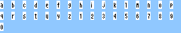

# Usage
If you wanted to add fonts to the pokeemerald decompilation, but it was too difficult to setup the graphics/font/*.png files, this will make it easier. It doesn't do it automatically, but it reduces the task to a copy paste task.

# Install
```bash
pip install -r requirements.txt
```

# Usage
```bash
ttf-to-png.py font.ttf 10 abcdefghijklmnopqrstuyz 1234567890
```

The above will convert the `"abcdefghijklmnopqrstuyz1234567890"` characters into a 16xH grid of 8x8 tiles, with each charcter inhabiting each tile. Note, you have to know the font size, 10 beforehand.




# Extra
Your most likely default argument for the characters:
```
À Á Â Ç È É Ê Ë Ì Î Ï Ò Ó Ô Œ Ù Ú Û Ñ ß à á ç è é ê ë ì î ï ò ó ô œ ù ú û ñ º ª & + = ; ¿ ¡ Í % ( ) â í < > 0 1 2 3 4 5 6 7 8 9 ! ? . - _ · … “ ” ‘ ’ ' ♂ ♀ ¥ , × / A B C D E F G H I J K L M N O P Q R S T U V W X Y Z a b c d e f g h i j k l m n o p q r s t u v w x y z ▶ : Ä Ö Ü ä ö ü $```

Missing: 
- SUPER_ER
- LV
- PK
- PKMN
- POKEBLOCK
- UNK_SPACER
- UP_ARROW
- DOWN_ARROW
- LEFT_ARROW
- RIGHT_ARROW
- SUPER_E
- SUPER_RE
- EMOJI_DIZZYEGG
- TALL_PLUS