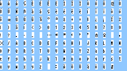

# Usage
If you wanted to add fonts to the pokeemerald decompilation, but it was too difficult to setup the graphics/font/*.png files, this will make it easier. It doesn't do it automatically, but it reduces the task to a copy paste task.

# Install
```bash
pip install -r requirements.txt
```

# Usage
```bash
ttf-to-png.py font.ttf 10 abcdefghijklmnopqrstuyz 1234567890
```

The above will convert the `"abcdefghijklmnopqrstuyz1234567890"` characters into a 16xH grid of 8x8 tiles, with each charcter inhabiting each tile. Note, you have to know the font size, 10 beforehand.

